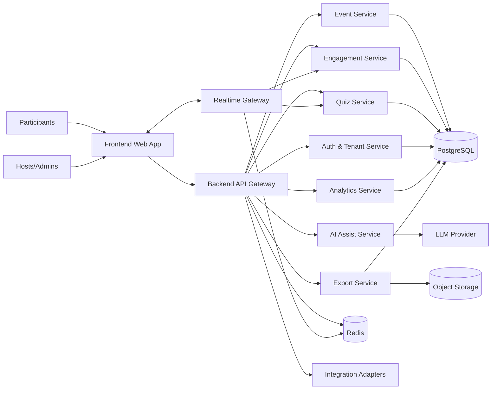
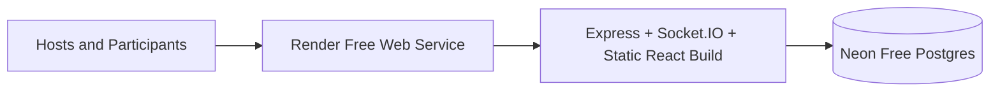
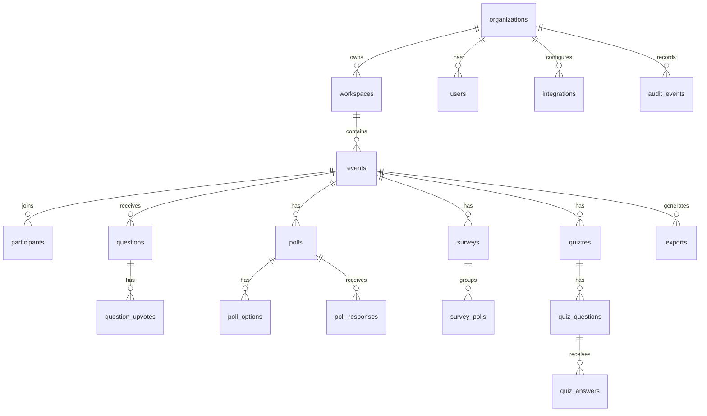
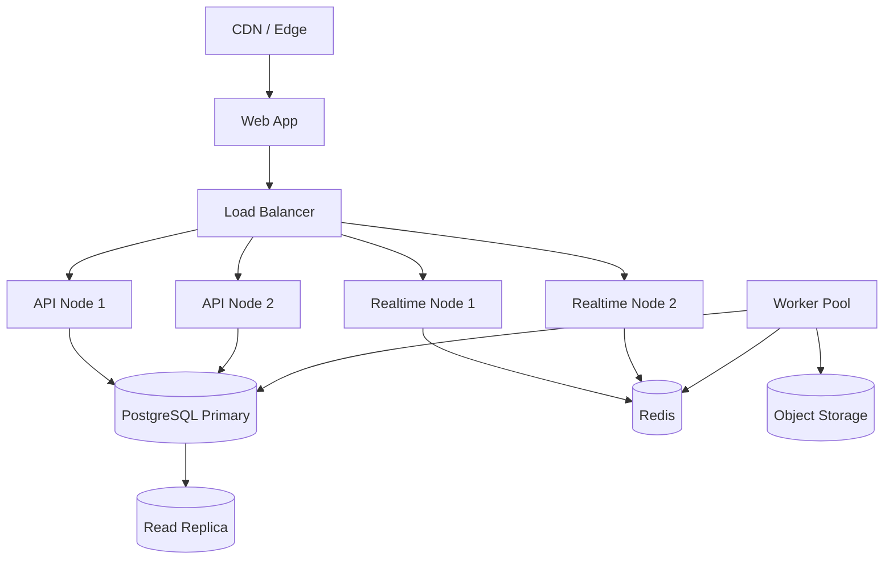

# High Level Design: Live Audience Interaction Platform

## 1. Purpose

This document defines the high level design for a modular full-stack SaaS platform for live audience engagement across meetings, webinars, training sessions, and events.

The final product name is still open. This HLD uses the neutral term **Audience Engagement Platform**.

## 2. Product Capabilities

The platform enables hosts to create live sessions where participants can join with a simple event code, link, or QR code without downloading an app.

Core capabilities:

- Live Q&A with anonymous or named submissions
- Upvoting and moderation controls
- Live polls across multiple question types
- Surveys made from bundled polls
- Word clouds from open text responses
- Live quizzes with scoring and leaderboards
- AI-assisted prompt, poll, and quiz generation
- Analytics dashboards and exports
- Enterprise controls including SSO, RBAC, audit logs, and compliance posture
- Integrations with presentation and meeting tools

## 3. Design Goals

- **Modular architecture:** clear separation of UI, API, realtime, domain, data, exports, analytics, and integrations.
- **Low-friction participation:** participants join without account creation.
- **Realtime by default:** questions, votes, poll results, and quiz scores update instantly.
- **Multi-tenant SaaS readiness:** support organizations, workspaces, roles, and billing plans.
- **Enterprise security:** SSO, RBAC, audit trail, encryption, retention policies, and compliance reporting.
- **Scale elasticity:** support small team meetings and high-volume events.
- **Exportable data:** CSV, XLSX, and PDF reporting with durable storage.
- **Integration-ready:** meeting, calendar, presentation, and identity providers can be added through adapters.

## 4. Architecture Overview



## 5. Recommended Technology Stack

Frontend:

- React with TypeScript
- Vite or Next.js App Router, depending on deployment needs
- Component library with design tokens
- Socket.IO client or native WebSocket client
- TanStack Query or SWR for API caching
- Zod for client/server contract validation

Backend:

- Node.js with TypeScript
- Fastify, NestJS, or Express with modular routers
- REST API for command/query operations
- WebSocket or Socket.IO gateway for realtime events
- PostgreSQL for durable relational data
- Redis for presence, pub/sub, rate limiting, ephemeral event state
- Object storage for exported reports and uploaded assets
- Queue worker for exports, analytics aggregation, and integrations

Infrastructure:

- CDN and edge caching for static assets
- Horizontal API and realtime nodes
- Managed PostgreSQL with backups and PITR
- Managed Redis
- Observability with logs, metrics, traces, and audit events

## 6. Modular Application Design

Recommended production repo structure:

```text
apps/
  web/                    # Host console and participant web app
  api/                    # REST API and WebSocket gateway
  worker/                 # Async jobs for exports, analytics, integrations
packages/
  ui/                     # Shared design system components
  domain/                 # Core business entities and rules
  contracts/              # API DTOs, schemas, event payloads
  db/                     # Migrations, schema, query helpers
  realtime/               # Realtime event types and helpers
  integrations/           # Provider adapter interfaces
  config/                 # Shared environment and feature config
```

For an early version, this can remain a single deployable app with the same internal folder boundaries.

## 6.1 Zero-Cost Deployment Target

The current codebase supports a zero-cost production-like deployment profile:



Runtime behavior:

- Local development uses SQLite for a no-setup developer experience.
- Cloud deployment uses PostgreSQL automatically when `DATABASE_URL` is set.
- A single Node web service serves the React build, REST API, exports, and Socket.IO realtime traffic.
- PostgreSQL migrations run at service startup, so there is no separate migration command on free infrastructure.

Free-tier caveat: this deployment profile is suitable for demos, pilots, and low-traffic production-like use. It does not replace paid infrastructure with uptime guarantees, backup guarantees, compliance operations, or dedicated capacity.

## 7. Frontend HLD

### 7.1 Frontend Modules

Host Console:

- Event dashboard
- Event setup and join-code management
- Q&A moderation queue
- Poll and survey builder
- Quiz builder and live quiz controller
- Live results and presenter view
- Analytics and export center
- Integration settings
- Organization and security settings

Participant App:

- Event code entry
- Participant profile state, optional name
- Anonymous mode
- Q&A submission and upvoting
- Active poll response
- Active quiz response
- Leaderboard and results views

Admin Console:

- Organization settings
- User and role management
- SSO configuration
- Compliance and audit log views
- Billing and plan controls
- Data retention settings

Shared UI:

- Buttons, inputs, tabs, modals, menus, badges, tables
- Poll result visualizations
- Word cloud component
- QR code component
- Toast and notification system
- Empty, loading, and error states

### 7.2 Frontend State Management

Recommended layers:

- URL state for selected event, tab, and presenter mode
- Server state via TanStack Query or SWR
- Realtime state via WebSocket event reducer
- Local state for drafts and forms
- Local storage for anonymous participant id and optional display name

### 7.3 Frontend Routing

```text
/                         # Host landing or dashboard redirect
/host                     # Host event list
/host/:eventCode          # Host event console
/host/:eventCode/presenter # Presenter display mode
/join                     # Event code entry
/join/:eventCode          # Participant experience
/admin/org                # Organization settings
/admin/security           # SSO, RBAC, retention, audit logs
```

### 7.4 Frontend Realtime Events

The UI should subscribe to event rooms:

```text
event:{eventId}
event:{eventId}:host
event:{eventId}:participants
```

Example realtime payloads:

```json
{
  "type": "question.created",
  "eventId": "evt_123",
  "questionId": "q_123",
  "createdAt": "2026-05-29T20:00:00Z"
}
```

```json
{
  "type": "poll.response_count_changed",
  "eventId": "evt_123",
  "pollId": "poll_123",
  "summary": {
    "totalResponses": 241
  }
}
```

## 8. Backend HLD

### 8.1 Backend Modules

API Gateway:

- Request validation
- Auth middleware
- Tenant resolution
- Rate limiting
- API versioning
- Error envelope normalization

Auth and Tenant Service:

- Organization and workspace management
- SSO integration
- User roles and permissions
- Session management
- Participant anonymous identity

Event Service:

- Event lifecycle
- Event codes and links
- QR code metadata
- Presenter mode
- Event configuration

Q&A Service:

- Question submission
- Anonymous/named settings
- Upvotes
- Moderation
- Pinned and answered states
- Profanity and abuse controls

Poll Service:

- Poll creation
- Poll activation and closing
- Multiple choice, rating, scale, open text, word cloud, yes/no
- Surveys as grouped polls
- Response deduplication per participant
- Result summaries

Quiz Service:

- Quiz creation
- Question progression
- Answer validation
- Scoring
- Leaderboard calculation
- Timing and anti-cheat controls

AI Assist Service:

- Poll suggestions
- Quiz suggestions
- Prompt rewriting
- Topic brainstorming
- Guardrails, prompt templates, and tenant policy filters

Analytics Service:

- Engagement metrics
- Funnel and participation metrics
- Poll summaries
- Q&A trends
- Quiz performance
- Export-ready reporting models

Export Service:

- CSV export
- XLSX export
- PDF report generation
- Async export jobs for large events
- Object storage links and retention policies

Integration Service:

- Presentation adapters
- Meeting app adapters
- Calendar adapters
- Webhook delivery
- OAuth token storage and refresh

Audit Service:

- Security-sensitive activity capture
- Admin changes
- Export access
- Login and SSO events
- Immutable audit trail

### 8.2 Backend API Boundary

Use REST for most host/admin commands and queries. Use WebSocket for realtime updates.

API versioning:

```text
/api/v1/...
```

Common response envelope:

```json
{
  "data": {},
  "meta": {
    "requestId": "req_123"
  }
}
```

Common error envelope:

```json
{
  "error": {
    "code": "POLL_NOT_ACTIVE",
    "message": "This poll is no longer accepting responses.",
    "requestId": "req_123"
  }
}
```

## 9. Backend API Design

### 9.1 Organization and Auth APIs

```http
POST   /api/v1/auth/login
POST   /api/v1/auth/logout
GET    /api/v1/me
GET    /api/v1/orgs
POST   /api/v1/orgs
GET    /api/v1/orgs/:orgId/members
POST   /api/v1/orgs/:orgId/members
PATCH  /api/v1/orgs/:orgId/members/:memberId
GET    /api/v1/orgs/:orgId/audit-events
```

### 9.2 Event APIs

```http
GET    /api/v1/events
POST   /api/v1/events
GET    /api/v1/events/:eventId
PATCH  /api/v1/events/:eventId
POST   /api/v1/events/:eventId/start
POST   /api/v1/events/:eventId/end
GET    /api/v1/events/code/:eventCode
```

### 9.3 Participant APIs

```http
POST   /api/v1/events/:eventId/participants
PATCH  /api/v1/events/:eventId/participants/:participantId
GET    /api/v1/events/:eventId/participant-state
```

### 9.4 Q&A APIs

```http
GET    /api/v1/events/:eventId/questions
POST   /api/v1/events/:eventId/questions
PATCH  /api/v1/events/:eventId/questions/:questionId
POST   /api/v1/events/:eventId/questions/:questionId/upvote
DELETE /api/v1/events/:eventId/questions/:questionId/upvote
POST   /api/v1/events/:eventId/questions/:questionId/hide
```

### 9.5 Poll and Survey APIs

```http
GET    /api/v1/events/:eventId/polls
POST   /api/v1/events/:eventId/polls
GET    /api/v1/events/:eventId/polls/:pollId
PATCH  /api/v1/events/:eventId/polls/:pollId
POST   /api/v1/events/:eventId/polls/:pollId/activate
POST   /api/v1/events/:eventId/polls/:pollId/close
POST   /api/v1/events/:eventId/polls/:pollId/responses
GET    /api/v1/events/:eventId/polls/:pollId/results
POST   /api/v1/events/:eventId/surveys
GET    /api/v1/events/:eventId/surveys/:surveyId
```

### 9.6 Quiz APIs

```http
GET    /api/v1/events/:eventId/quizzes
POST   /api/v1/events/:eventId/quizzes
GET    /api/v1/events/:eventId/quizzes/:quizId
PATCH  /api/v1/events/:eventId/quizzes/:quizId
POST   /api/v1/events/:eventId/quizzes/:quizId/start
POST   /api/v1/events/:eventId/quizzes/:quizId/advance
POST   /api/v1/events/:eventId/quizzes/:quizId/finish
POST   /api/v1/events/:eventId/quizzes/:quizId/answers
GET    /api/v1/events/:eventId/quizzes/:quizId/leaderboard
```

### 9.7 AI, Analytics, and Export APIs

```http
POST   /api/v1/ai/poll-suggestions
POST   /api/v1/ai/quiz-suggestions
POST   /api/v1/ai/refine-question
GET    /api/v1/events/:eventId/analytics
POST   /api/v1/events/:eventId/exports
GET    /api/v1/events/:eventId/exports
GET    /api/v1/exports/:exportId/download
```

## 10. Database HLD

Recommended database: PostgreSQL.

### 10.1 Core Entities



### 10.2 PostgreSQL Schema Draft

```sql
CREATE TABLE organizations (
  id UUID PRIMARY KEY,
  name TEXT NOT NULL,
  slug TEXT UNIQUE NOT NULL,
  plan TEXT NOT NULL DEFAULT 'free',
  sso_enabled BOOLEAN NOT NULL DEFAULT FALSE,
  sso_provider TEXT,
  data_retention_days INTEGER,
  created_at TIMESTAMPTZ NOT NULL DEFAULT now(),
  updated_at TIMESTAMPTZ NOT NULL DEFAULT now()
);

CREATE TABLE users (
  id UUID PRIMARY KEY,
  organization_id UUID NOT NULL REFERENCES organizations(id),
  email TEXT NOT NULL,
  name TEXT NOT NULL,
  role TEXT NOT NULL CHECK (role IN ('owner', 'admin', 'host', 'analyst')),
  status TEXT NOT NULL DEFAULT 'active',
  created_at TIMESTAMPTZ NOT NULL DEFAULT now(),
  updated_at TIMESTAMPTZ NOT NULL DEFAULT now(),
  UNIQUE (organization_id, email)
);

CREATE TABLE workspaces (
  id UUID PRIMARY KEY,
  organization_id UUID NOT NULL REFERENCES organizations(id),
  name TEXT NOT NULL,
  created_by UUID REFERENCES users(id),
  created_at TIMESTAMPTZ NOT NULL DEFAULT now(),
  updated_at TIMESTAMPTZ NOT NULL DEFAULT now()
);

CREATE TABLE events (
  id UUID PRIMARY KEY,
  workspace_id UUID NOT NULL REFERENCES workspaces(id),
  host_user_id UUID REFERENCES users(id),
  title TEXT NOT NULL,
  event_code TEXT UNIQUE NOT NULL,
  status TEXT NOT NULL CHECK (status IN ('draft', 'live', 'ended', 'archived')),
  participant_access TEXT NOT NULL DEFAULT 'public_code',
  anonymous_questions_enabled BOOLEAN NOT NULL DEFAULT TRUE,
  moderation_enabled BOOLEAN NOT NULL DEFAULT TRUE,
  starts_at TIMESTAMPTZ,
  ends_at TIMESTAMPTZ,
  created_at TIMESTAMPTZ NOT NULL DEFAULT now(),
  updated_at TIMESTAMPTZ NOT NULL DEFAULT now()
);

CREATE TABLE participants (
  id UUID PRIMARY KEY,
  event_id UUID NOT NULL REFERENCES events(id) ON DELETE CASCADE,
  public_id TEXT NOT NULL,
  display_name TEXT,
  is_anonymous BOOLEAN NOT NULL DEFAULT TRUE,
  joined_at TIMESTAMPTZ NOT NULL DEFAULT now(),
  last_seen_at TIMESTAMPTZ,
  UNIQUE (event_id, public_id)
);

CREATE TABLE questions (
  id UUID PRIMARY KEY,
  event_id UUID NOT NULL REFERENCES events(id) ON DELETE CASCADE,
  participant_id UUID REFERENCES participants(id),
  body TEXT NOT NULL,
  display_name TEXT,
  is_anonymous BOOLEAN NOT NULL DEFAULT TRUE,
  status TEXT NOT NULL CHECK (status IN ('visible', 'hidden', 'answered', 'deleted')),
  is_pinned BOOLEAN NOT NULL DEFAULT FALSE,
  created_at TIMESTAMPTZ NOT NULL DEFAULT now(),
  updated_at TIMESTAMPTZ NOT NULL DEFAULT now()
);

CREATE TABLE question_upvotes (
  question_id UUID NOT NULL REFERENCES questions(id) ON DELETE CASCADE,
  participant_id UUID NOT NULL REFERENCES participants(id) ON DELETE CASCADE,
  created_at TIMESTAMPTZ NOT NULL DEFAULT now(),
  PRIMARY KEY (question_id, participant_id)
);

CREATE TABLE polls (
  id UUID PRIMARY KEY,
  event_id UUID NOT NULL REFERENCES events(id) ON DELETE CASCADE,
  title TEXT NOT NULL,
  poll_type TEXT NOT NULL CHECK (
    poll_type IN ('multiple_choice', 'rating', 'open_text', 'word_cloud', 'scale', 'yes_no')
  ),
  status TEXT NOT NULL CHECK (status IN ('draft', 'active', 'closed', 'archived')),
  allow_multiple_answers BOOLEAN NOT NULL DEFAULT FALSE,
  survey_id UUID,
  created_by UUID REFERENCES users(id),
  activated_at TIMESTAMPTZ,
  closed_at TIMESTAMPTZ,
  created_at TIMESTAMPTZ NOT NULL DEFAULT now(),
  updated_at TIMESTAMPTZ NOT NULL DEFAULT now()
);

CREATE TABLE poll_options (
  id UUID PRIMARY KEY,
  poll_id UUID NOT NULL REFERENCES polls(id) ON DELETE CASCADE,
  label TEXT NOT NULL,
  sort_order INTEGER NOT NULL DEFAULT 0
);

CREATE TABLE poll_responses (
  id UUID PRIMARY KEY,
  poll_id UUID NOT NULL REFERENCES polls(id) ON DELETE CASCADE,
  participant_id UUID NOT NULL REFERENCES participants(id) ON DELETE CASCADE,
  option_id UUID REFERENCES poll_options(id),
  response_text TEXT,
  numeric_value NUMERIC,
  created_at TIMESTAMPTZ NOT NULL DEFAULT now(),
  UNIQUE (poll_id, participant_id)
);

CREATE TABLE surveys (
  id UUID PRIMARY KEY,
  event_id UUID NOT NULL REFERENCES events(id) ON DELETE CASCADE,
  title TEXT NOT NULL,
  status TEXT NOT NULL CHECK (status IN ('draft', 'active', 'closed', 'archived')),
  created_by UUID REFERENCES users(id),
  created_at TIMESTAMPTZ NOT NULL DEFAULT now(),
  updated_at TIMESTAMPTZ NOT NULL DEFAULT now()
);

CREATE TABLE survey_polls (
  survey_id UUID NOT NULL REFERENCES surveys(id) ON DELETE CASCADE,
  poll_id UUID NOT NULL REFERENCES polls(id) ON DELETE CASCADE,
  sort_order INTEGER NOT NULL DEFAULT 0,
  PRIMARY KEY (survey_id, poll_id)
);

CREATE TABLE quizzes (
  id UUID PRIMARY KEY,
  event_id UUID NOT NULL REFERENCES events(id) ON DELETE CASCADE,
  title TEXT NOT NULL,
  status TEXT NOT NULL CHECK (status IN ('draft', 'active', 'finished', 'archived')),
  current_question_id UUID,
  created_by UUID REFERENCES users(id),
  started_at TIMESTAMPTZ,
  finished_at TIMESTAMPTZ,
  created_at TIMESTAMPTZ NOT NULL DEFAULT now(),
  updated_at TIMESTAMPTZ NOT NULL DEFAULT now()
);

CREATE TABLE quiz_questions (
  id UUID PRIMARY KEY,
  quiz_id UUID NOT NULL REFERENCES quizzes(id) ON DELETE CASCADE,
  body TEXT NOT NULL,
  options JSONB NOT NULL,
  correct_option_index INTEGER NOT NULL,
  points INTEGER NOT NULL DEFAULT 100,
  time_limit_seconds INTEGER,
  sort_order INTEGER NOT NULL DEFAULT 0
);

CREATE TABLE quiz_answers (
  id UUID PRIMARY KEY,
  quiz_question_id UUID NOT NULL REFERENCES quiz_questions(id) ON DELETE CASCADE,
  participant_id UUID NOT NULL REFERENCES participants(id) ON DELETE CASCADE,
  answer_index INTEGER NOT NULL,
  is_correct BOOLEAN NOT NULL,
  points_awarded INTEGER NOT NULL DEFAULT 0,
  answered_at TIMESTAMPTZ NOT NULL DEFAULT now(),
  UNIQUE (quiz_question_id, participant_id)
);

CREATE TABLE exports (
  id UUID PRIMARY KEY,
  event_id UUID NOT NULL REFERENCES events(id) ON DELETE CASCADE,
  requested_by UUID REFERENCES users(id),
  export_type TEXT NOT NULL CHECK (export_type IN ('csv', 'xlsx', 'pdf')),
  status TEXT NOT NULL CHECK (status IN ('queued', 'processing', 'ready', 'failed')),
  storage_url TEXT,
  error_message TEXT,
  created_at TIMESTAMPTZ NOT NULL DEFAULT now(),
  completed_at TIMESTAMPTZ
);

CREATE TABLE integrations (
  id UUID PRIMARY KEY,
  organization_id UUID NOT NULL REFERENCES organizations(id),
  provider TEXT NOT NULL,
  status TEXT NOT NULL DEFAULT 'connected',
  config JSONB NOT NULL DEFAULT '{}',
  encrypted_credentials BYTEA,
  created_at TIMESTAMPTZ NOT NULL DEFAULT now(),
  updated_at TIMESTAMPTZ NOT NULL DEFAULT now(),
  UNIQUE (organization_id, provider)
);

CREATE TABLE audit_events (
  id UUID PRIMARY KEY,
  organization_id UUID NOT NULL REFERENCES organizations(id),
  actor_user_id UUID REFERENCES users(id),
  event_type TEXT NOT NULL,
  entity_type TEXT,
  entity_id UUID,
  ip_address INET,
  user_agent TEXT,
  metadata JSONB NOT NULL DEFAULT '{}',
  created_at TIMESTAMPTZ NOT NULL DEFAULT now()
);
```

### 10.3 Key Indexes

```sql
CREATE INDEX idx_events_workspace_status ON events(workspace_id, status);
CREATE INDEX idx_events_code ON events(event_code);
CREATE INDEX idx_questions_event_status ON questions(event_id, status, created_at DESC);
CREATE INDEX idx_question_upvotes_question ON question_upvotes(question_id);
CREATE INDEX idx_polls_event_status ON polls(event_id, status);
CREATE INDEX idx_poll_responses_poll ON poll_responses(poll_id);
CREATE INDEX idx_quiz_answers_question ON quiz_answers(quiz_question_id);
CREATE INDEX idx_audit_events_org_created ON audit_events(organization_id, created_at DESC);
```

## 11. Realtime Design

### 11.1 WebSocket Events

Client to server:

```text
event.join
event.leave
question.create
question.upvote
poll.respond
quiz.answer
presence.heartbeat
```

Server to client:

```text
event.updated
question.created
question.updated
question.vote_count_changed
poll.activated
poll.closed
poll.results_updated
quiz.started
quiz.question_changed
quiz.leaderboard_updated
presence.updated
```

### 11.2 Scaling Realtime

- Use Redis pub/sub or Redis Streams to broadcast between API nodes.
- Use sticky sessions only if the WebSocket provider requires it.
- Keep durable state in PostgreSQL.
- Keep ephemeral presence and throttling state in Redis.
- Rate limit anonymous participant actions by event, participant id, and IP hash.

## 12. Analytics Design

Analytics should be split into:

- **Live analytics:** fast counters for current event state.
- **Historical analytics:** durable, queryable facts for post-event reporting.

Live analytics can be computed from Redis counters plus database reads.

Historical analytics should be materialized into tables or views:

```text
event_engagement_summary
poll_response_summary
quiz_leaderboard_snapshot
question_activity_summary
```

Large events should use async aggregation workers rather than computing every dashboard metric from raw rows on every request.

## 13. Security and Compliance

Authentication:

- Host/admin users authenticate with email/password, magic link, or SSO.
- Participants can join anonymously through event code unless event policy requires registration.

Authorization:

- Organization-level RBAC
- Workspace-level event access
- Host, admin, analyst, owner roles
- Fine-grained permissions for exports, moderation, integrations, and security settings

Data protection:

- TLS in transit
- Encryption at rest
- Encrypted integration credentials
- Optional PII minimization for anonymous participation
- Configurable data retention
- Export access audit logs

Compliance readiness:

- Audit event logging
- SSO support
- Access review support
- Data deletion workflows
- DPA and retention policy support

Important note: ISO, SOC 2, and HIPAA readiness are organizational programs, not only code features. The product can provide technical controls that support those programs.

## 14. Integration HLD

Use adapter interfaces so providers can be swapped without changing core modules.

```ts
interface MeetingProviderAdapter {
  provider: string;
  createMeetingLink(input: CreateMeetingInput): Promise<MeetingLink>;
  installApp(input: InstallAppInput): Promise<InstallResult>;
}

interface PresentationProviderAdapter {
  provider: string;
  getDeck(input: DeckRequest): Promise<DeckMetadata>;
  embedActivity(input: EmbedActivityInput): Promise<EmbedResult>;
}
```

Initial adapters:

- Microsoft PowerPoint
- Google Slides
- Zoom
- Webex
- Microsoft Teams
- Okta
- Microsoft Azure AD
- Auth0

## 15. Export Design

Small events:

- Generate CSV, XLSX, or PDF synchronously.

Large events:

- Create export job.
- Worker generates file.
- Store file in object storage.
- Return signed download link.
- Record audit event.

Export object:

```json
{
  "id": "exp_123",
  "eventId": "evt_123",
  "type": "xlsx",
  "status": "ready",
  "downloadUrl": "https://storage.example.com/signed-url",
  "expiresAt": "2026-05-30T20:00:00Z"
}
```

## 16. Non-Functional Requirements

Availability:

- Target 99.95 percent platform uptime.
- API and realtime nodes deployed across multiple instances.
- Database backups with PITR.

Performance:

- Participant join under 2 seconds on normal network.
- Poll response acknowledgement under 500 ms at p95.
- Realtime result broadcast under 1 second at p95.

Scale:

- Single event: from 10 to 50,000 participants.
- Horizontal API and realtime scaling.
- Backpressure on chatty realtime updates.
- Result aggregation batching for very large events.

Reliability:

- Idempotency keys for response submission.
- Unique constraints to prevent duplicate votes and answers.
- Queue retry policy for exports and integrations.
- Dead-letter queue for failed jobs.

Observability:

- Request logs with request id.
- WebSocket connection metrics.
- Event-level response latency.
- Export job metrics.
- Integration failure metrics.
- Audit trail for admin and data access actions.

## 17. Deployment View



## 18. Implementation Phases

Phase 1: Modular MVP

- React host and participant UI
- Node API
- PostgreSQL persistence
- WebSocket realtime
- Q&A, polls, quizzes
- Basic analytics
- CSV/XLSX/PDF exports

Phase 2: SaaS Foundation

- Organizations and workspaces
- User auth and RBAC
- Audit logs
- Billing plan flags
- Async workers
- Object storage exports

Phase 3: Enterprise and Scale

- SSO providers
- Integration adapters
- Advanced analytics
- Large event scaling
- Data retention controls
- Compliance reporting support

Phase 4: AI and Automation

- AI prompt library
- Poll and quiz generation
- Meeting summary insights
- Suggested follow-up questions
- Automated post-event reports

## 19. Architecture Decisions

Recommended decisions:

- Use PostgreSQL as the system of record.
- Use Redis for presence, pub/sub, and rate limits.
- Use WebSockets for low-latency live updates.
- Use async workers for exports and integrations.
- Keep participant access anonymous by default but attach stable anonymous participant ids per event.
- Use modular service boundaries inside one deployable backend first, then split services only when scale requires it.

## 20. Open Decisions

- Final product name
- Next.js versus Vite SPA for production frontend
- Auth provider selection
- Cloud provider and deployment target
- Billing provider
- LLM provider and AI governance policy
- Data residency requirements
